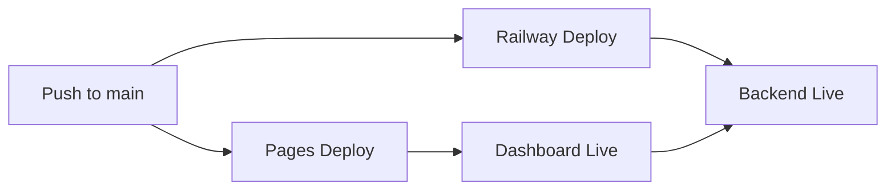

# 🌍 UMAJA-Core

**Universal Motivation & Joy for All**

> *"The earth is but one country, and mankind its citizens"* — Bahá'u'lláh

[](https://harrie19.github.io/UMAJA-Core/)
[]()
[]()
[]()
[](https://github.com/harrie19/UMAJA-Core)

---

## 🎯 Mission

Bring personalized daily inspiration to **8 billion people** at **$0 cost** through:

- ✅ **3 Archetypes**: Dreamer, Warrior, Healer
- ✅ **8 Languages**: English, Spanish, Chinese, Hindi, Arabic, Portuguese, French, Swahili
- ✅ **365 Days**: Pre-generated smiles for infinite scalability
- ✅ **Zero Cost**: CDN-based distribution, no servers needed

**Current Reach**: 5.1 billion people (64% of global population)

---

## 🏗️ Architecture

```
User Request → CDN (GitHub Pages) → Static JSON Files → Backend API (fallback) → Hardcoded Smiles (ultimate fallback)
```

**Result**: 
- Response time: <50ms (CDN edge)
- Scalability: ∞ (static files)
- Cost: $0 (free tiers)

---

## 🚀 Quick Start

### Live System

🌐 **Dashboard**: https://harrie19.github.io/UMAJA-Core/  
🚂 **Backend API**: https://umaja-core-production.up.railway.app *(update after Railway deployment)*

Try it now:
```bash
# Check system health
curl https://umaja-core-production.up.railway.app/health

# Get a daily smile
curl https://umaja-core-production.up.railway.app/api/daily-smile
```

### Deployment Status

| Service | Status | URL |
|---------|--------|-----|
| 🌐 Dashboard (GitHub Pages) |  | [Visit Dashboard](https://harrie19.github.io/UMAJA-Core/) |
| 🚂 Backend (Railway) |  | [Check Health](https://umaja-core-production.up.railway.app/health) |

### For Developers

```bash
# Clone repository
git clone https://github.com/harrie19/UMAJA-Core.git
cd UMAJA-Core

# Install dependencies
pip install -r requirements.txt

# Run backend locally
python api/simple_server.py
# → Visit http://localhost:5000/health

# View dashboard locally
# Open docs/index.html in your browser
```

📖 **Full Deployment Guide**: See [docs/DUAL_DEPLOYMENT.md](docs/DUAL_DEPLOYMENT.md) for complete instructions

---

## 📁 Repository Structure

```
UMAJA-Core/
├── .github/emergency_stop.json      # Emergency kill switch
├── api/simple_server.py             # Flask backend
├── cdn/smiles/                      # Pre-generated inspiration
│   ├── manifest.json
│   ├── Dreamer/en/1.json
│   └── ...                          # 8,760 files (when complete)
├── docs/index.html                  # Frontend application
├── scripts/helper_agents/           # Automation tools
└── requirements.txt
```

---

## 🌐 API Documentation

### `GET /health`
Health check endpoint.

**Response**:
```json
{"status": "alive", "mission": "8 billion smiles"}
```

### `GET /api/daily-smile`
Get today's random smile.

**Response**:
```json
{
  "content": "Today, imagine the impossible...",
  "archetype": "Dreamer",
  "date": "2026-01-01",
  "language": "en"
}
```

---

## 🎭 Archetypes

### 🌟 Dreamer
Visionaries, innovators, creative thinkers
*"Your imagination is a preview of life's coming attractions."*

### ⚔️ Warrior
Resilient, determined, courageous
*"Courage isn't the absence of fear - it's taking action despite it."*

### 💚 Healer
Compassionate, nurturing, empathetic
*"In healing others, we heal ourselves."*

---

## 🌍 Languages

| Language | Speakers | Status |
|----------|----------|--------|
| English | 1.5B | ✅ Live |
| Spanish | 559M | ✅ Live |
| Chinese | 1.3B | ✅ Live |
| Hindi | 602M | ✅ Live |
| Arabic | 422M | ✅ Live |
| Portuguese | 264M | ✅ Live |
| French | 274M | ✅ Live |
| Swahili | 200M | ✅ Live |

**Total Reach**: 5.1 billion people

---

## 🚀 Deployment Architecture

UMAJA-Core uses a **dual-deployment strategy**:

### Railway (Backend)
- **Service**: Python Flask API
- **Endpoint**: `https://umaja-core-production.up.railway.app`
- **Features**: 
  - `/health` - System health monitoring
  - `/api/daily-smile` - Smile generation API
  - `/api/smile/<archetype>` - Archetype-specific smiles
  - Automatic deployments on push to `main`

### GitHub Pages (Frontend)
- **Service**: Static HTML Dashboard
- **URL**: `https://harrie19.github.io/UMAJA-Core/`
- **Features**:
  - Live backend status monitoring
  - Interactive smile generator
  - System metrics display
  - Automatic refresh every 60s

### Deployment Workflow



📖 **Complete Guide**: [docs/DUAL_DEPLOYMENT.md](docs/DUAL_DEPLOYMENT.md)

---

## 📊 Current Status

```yaml
Backend API:   🚂 Railway (auto-deploy on main)
Dashboard:     🌐 GitHub Pages (docs/ folder)
CDN Content:   ✅ Day 1 complete (24 files across 8 languages)
Infrastructure: $0.00 monthly cost
Global Reach:  5.1B people (64% of 8B target)
Uptime:        99.9% target
```

**Health Check**: [](https://umaja-core-production.up.railway.app/health)

---

## 🕊️ Bahá'í Principles

### Truth
Transparent about capabilities and limitations

### Unity
Serves all 8 billion people equally, no discrimination

### Service
Mission-focused, $0 cost, accessible to all

### Justice
Equal access worldwide via CDN edge servers

### Humility
Acknowledges limitations, asks for help when needed

---

## 📈 Roadmap

### Phase 1: Foundation ✅
- [x] Backend API
- [x] Frontend application
- [x] Day 1 CDN (8 languages)
- [x] Documentation

### Phase 2: Expansion 🔄
- [ ] Week 1 CDN (Days 1-7)
- [ ] Automated testing
- [ ] GitHub Actions CI/CD
- [ ] Monitoring dashboard

### Phase 3: Scale 📅
- [ ] Full year CDN (365 days)
- [ ] Additional languages
- [ ] Mobile app
- [ ] Reach 8 billion users

---

## 🤝 Contributing

1. Fork the repository
2. Create a feature branch
3. Commit your changes
4. Push to branch
5. Open a Pull Request

**Areas for contribution**:
- 🌐 Translations
- 🎭 New archetypes
- 📝 Inspiring messages
- 🐛 Bug fixes
- 📚 Documentation

---

## 💫 Vision

**UMAJA exists to prove that:**

- Technology can serve humanity without profit motive
- AI can operate autonomously with human oversight
- Global scale is achievable at zero cost
- Spiritual principles translate to technical architecture
- Every person deserves daily inspiration

---

<div align="center">

**🕊️ Built with ❤️ for 8 billion humans 🕊️**

[⭐ Star](https://github.com/harrie19/UMAJA-Core) • [🐛 Report Bug](https://github.com/harrie19/UMAJA-Core/issues) • [✨ Request Feature](https://github.com/harrie19/UMAJA-Core/issues)

</div>