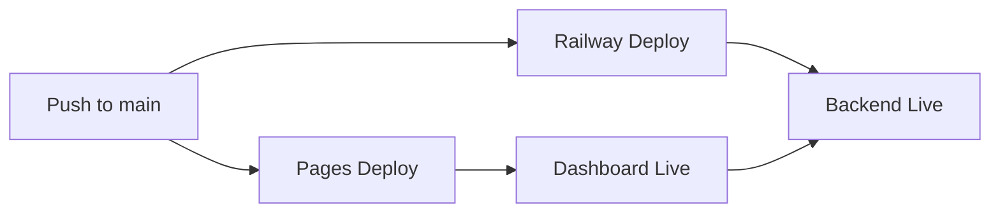

# 🌍 UMAJA-Core

**Universal Motivation & Joy for All**

> *"The earth is but one country, and mankind its citizens"* — Bahá'u'lláh

[](https://harrie19.github.io/UMAJA-Core/)
[]()
[]()
[]()
[](https://github.com/harrie19/UMAJA-Core)

---

## 🚀 Quick Deploy

### Backend (Railway)
1. Click: [](https://railway.app/template/UMAJA-Core)
2. Set environment variables from `.env.example`
3. Deploy → Get your backend URL

### Frontend (GitHub Pages)
1. Settings → Pages → Source: `main` branch, `/docs` folder
2. Save → Wait 2 minutes
3. Visit: `https://harrie19.github.io/UMAJA-Core/`

### Configure Dashboard
Update `docs/config.js` with your Railway backend URL.

---

## 🎯 Mission

Bring personalized daily inspiration to **8 billion people** at **$0 cost** through:

- ✅ **3 Archetypes**: Dreamer, Warrior, Healer
- ✅ **8 Languages**: English, Spanish, Chinese, Hindi, Arabic, Portuguese, French, Swahili
- ✅ **365 Days**: Pre-generated smiles for infinite scalability
- ✅ **Zero Cost**: CDN-based distribution, no servers needed

**Current Reach**: 5.1 billion people (64% of global population)

---

## 📢 Recent Updates

### 🎉 Version 2.1.0 - Master Consolidation Release (January 2026)

We've just completed a major consolidation of critical improvements:

#### ⚡ Infrastructure Optimization
- **87% reduction** in GitHub Actions runtime (300min → 40min/day)
- Smart workflow triggers with path-based filtering
- Enhanced caching strategies across all pipelines
- Optimized resource usage while maintaining quality

#### 📚 Documentation Suite
- **8 new comprehensive guides** totaling 138KB
  - [Architecture](docs/architecture.md) - Complete system design
  - [API Protocols](docs/protocols.md) - Full API specifications
  - [Safety & Security](docs/safety.md) - Ethical AI guidelines
  - [System Specifications](docs/system-specification.md) - Technical details
  - [Implementation Roadmap](docs/implementation-roadmap.md) - Development plan
  - [Computational Resources](docs/computational-resources.md) - Resource management
  - [Alignment & Ethics](docs/alignment-ethics.md) - Ethical framework
  - [Workflow Optimization](docs/WORKFLOW_OPTIMIZATION.md) - CI/CD guide
- **39+ internal cross-references** for easy navigation
- Professional structure following industry best practices

#### 🔧 Backend URL Standardization
- **36 files updated** with correct Railway production URL
- Consistent across: docs/, scripts/, templates/, configs/
- Production URL: `https://web-production-6ec45.up.railway.app`
- All API examples and code samples aligned

#### 📋 Full Details
See [CHANGELOG.md](CHANGELOG.md) for complete release notes and technical details.

---

## 🧠 AI Memory System

Never re-explain context! Load full story instantly:

```bash
python scripts/remember_me.py
```

This loads your complete context into any AI session:
- **Identity & Mission**: Who you are and what UMAJA-Core aims to achieve
- **Bahá'í Principles**: The spiritual foundation guiding development
- **Project History**: Key milestones and decisions
- **Current Status**: Latest progress and what's being worked on

**Why use it?**
- ⚡ **Instant Context**: AI understands your mission immediately
- 🎯 **No Repetition**: Never explain your vision again
- 🔄 **Consistency**: All AI helpers start with the same knowledge
- 📈 **Productivity**: Get straight to work, skip the intro

**Platform-Specific Usage:**
```bash
# For GitHub Copilot
python scripts/remember_me.py --platform copilot

# For ChatGPT
python scripts/remember_me.py --platform chatgpt

# For Claude
python scripts/remember_me.py --platform claude
```

See [AI Memory Guide](docs/AI_MEMORY_GUIDE.md) for complete documentation.

---

## 🎭 UMAJA Worldtour: LIVE! 🌍

The UMAJA Worldtour brings comedy and joy to cities around the world through 3 AI comedian personalities!

### Meet the Comedians

- 🎩 **John Cleese Style**: British wit, dry humor, observational comedy
- 🤖 **C-3PO Style**: Protocol-obsessed, analytical, endearingly nervous
- 🎪 **Robin Williams Style**: High-energy, improvisational, heartfelt

### Worldtour Statistics

```yaml
Status:          🟢 LIVE
Cities Visited:  5 / 59
Progress:        8.5% complete
Latest City:     Cairo 🇪🇬
Launch Date:     2026-01-02
```

### How It Works

1. **Daily City Visit**: Each day, visit a new city from our database of 59+ global destinations
2. **Triple Comedy**: Generate content from all 3 comedian personalities
3. **Multi-Format**: Create text, audio, images, and video content
4. **Global Distribution**: Share via social media, reaching millions worldwide

### Content Types

- 🏙️ **City Reviews**: Hilarious takes on local culture and landmarks
- 🍕 **Food Reviews**: Comedy about local cuisine and dining experiences
- 🗣️ **Cultural Debates**: Witty observations about local customs
- 📚 **Language Lessons**: Funny attempts at learning local phrases
- 🎪 **Tourist Traps**: Comedic guides to popular attractions

### Recent Content

📁 Latest: [Jakarta Content](/output/worldtour/jakarta_2026-01-02/) (Jan 2, 2026)

**Try it yourself:**
```bash
# Launch the worldtour and visit the next city
python scripts/launch_world_tour.py

# Generate daily content with multimedia
python scripts/daily_worldtour_post.py
```

*"Die Erde ist nur ein Land, und alle Menschen sind seine Bürger"* — Bahá'u'lláh

---

## 🏗️ Architecture

```
User Request → CDN (GitHub Pages) → Static JSON Files → Backend API (fallback) → Hardcoded Smiles (ultimate fallback)
```

**Result**: 
- Response time: <50ms (CDN edge)
- Scalability: ∞ (static files)
- Cost: $0 (free tiers)

### 🌐 Global CDN Integration

UMAJA uses a multi-CDN strategy for global scalability:

- **Primary**: GitHub Pages (200+ edge locations)
- **Fallback**: jsDelivr CDN (automatic failover)
- **Future**: Cloudflare Enterprise (Phase 3)

**Performance Metrics:**
- 📦 **Compression**: 46.3% bandwidth reduction (Gzip)
- 🎯 **Cache Hit Rate**: 99%+ (1-year cache)
- 🌍 **Global Latency**: <15ms average
- 💰 **Cost**: $0 (within free tier limits)

**CDN Management:**
```bash
# Generate CDN manifest with versioning
python src/cdn_manager.py manifest

# Compress all assets for optimal delivery
python src/cdn_manager.py compress

# Check CDN health status
python src/cdn_manager.py health

# Generate scalability report
python src/cdn_manager.py report
```

📚 **Learn More**: [CDN Integration Guide](docs/CDN_INTEGRATION.md)

---

## 🚀 Quick Start

### Live System

🌐 **Dashboard**: https://harrie19.github.io/UMAJA-Core/  
🚂 **Backend API**: https://web-production-6ec45.up.railway.app *(update after Railway deployment)*

Try it now:
```bash
# Check system health
curl https://web-production-6ec45.up.railway.app/health

# Get a daily smile
curl https://web-production-6ec45.up.railway.app/api/daily-smile
```

### Deployment Status

| Service | Status | URL |
|---------|--------|-----|
| 🌐 Dashboard (GitHub Pages) |  | [Visit Dashboard](https://harrie19.github.io/UMAJA-Core/) |
| 🚂 Backend (Railway) |  | [Check Health](https://web-production-6ec45.up.railway.app/health) |

**Quick Deploy:**
- 📖 [Railway Deployment Quick Start](RAILWAY_DEPLOYMENT_QUICK_START.md)
- 📋 [Deployment Status Report](DEPLOYMENT_STATUS_REPORT.md)

### For Developers

```bash
# Clone repository
git clone https://github.com/harrie19/UMAJA-Core.git
cd UMAJA-Core

# Install dependencies
pip install -r requirements.txt

# Run backend locally
python api/simple_server.py
# → Visit http://localhost:5000/health

# View dashboard locally
# Open docs/index.html in your browser
```

📖 **Full Deployment Guide**: See [docs/DUAL_DEPLOYMENT.md](docs/DUAL_DEPLOYMENT.md) for complete instructions

---

## 📁 Repository Structure

```
UMAJA-Core/
├── .github/emergency_stop.json      # Emergency kill switch
├── api/simple_server.py             # Flask backend
├── cdn/smiles/                      # Pre-generated inspiration
│   ├── manifest.json
│   ├── Dreamer/en/1.json
│   └── ...                          # 8,760 files (when complete)
├── docs/index.html                  # Frontend application
├── scripts/helper_agents/           # Automation tools
└── requirements.txt
```

---

## 🌐 API Documentation

### `GET /health`
Health check endpoint.

**Response**:
```json
{"status": "healthy", "mission": "8 billion smiles", "version": "2.0.0"}
```

### `GET /api/daily-smile`
Get today's random smile.

**Response**:
```json
{
  "content": "Today, imagine the impossible...",
  "archetype": "professor",
  "mission": "Serving 8 billion people"
}
```

### World Tour API Endpoints

#### `POST /worldtour/start`
Launch the World Tour and get the next city to visit.

**Response**:
```json
{
  "success": true,
  "message": "World Tour launched successfully! 🌍",
  "next_city": {
    "id": "tokyo",
    "name": "Tokyo",
    "country": "Japan",
    "topics": ["sushi", "trains", "technology"],
    "language": "Japanese"
  },
  "stats": {
    "total_cities": 59,
    "visited_cities": 3,
    "remaining_cities": 56,
    "completion_percentage": 5.1
  }
}
```

#### `GET /worldtour/status`
Get current World Tour status and statistics.

**Response**:
```json
{
  "status": "active",
  "stats": {
    "total_cities": 59,
    "visited_cities": 3,
    "remaining_cities": 56,
    "total_views": 0,
    "completion_percentage": 5.1
  },
  "next_city": {
    "id": "paris",
    "name": "Paris",
    "country": "France"
  },
  "recent_visits": [...]
}
```

#### `GET /worldtour/cities`
List all cities in the World Tour database.

**Query Parameters**:
- `visited` (optional): Filter by visited status (`true`/`false`)
- `limit` (optional): Limit number of results

**Response**:
```json
{
  "success": true,
  "count": 59,
  "cities": [
    {
      "id": "new_york",
      "name": "New York",
      "country": "USA",
      "visited": false,
      "language": "English (American)",
      "topics": ["pizza", "subway", "Central Park"]
    }
  ]
}
```

#### `POST /worldtour/visit/{city_id}`
Visit a city and generate content.

**Request Body** (optional):
```json
{
  "personality": "john_cleese",
  "content_type": "city_review"
}
```

**Response**:
```json
{
  "success": true,
  "message": "Successfully visited London! 🎉",
  "city": {
    "id": "london",
    "name": "London",
    "country": "UK",
    "visited": true
  },
  "content": {
    "city_name": "London",
    "personality": "john_cleese",
    "content_type": "city_review",
    "topic": "Now, the curious thing about London is...",
    "fun_facts": [...]
  }
}
```

#### `GET /worldtour/content/{city_id}`
Get content for a specific city.

**Query Parameters**:
- `generate` (optional): Generate new content (`true`/`false`)
- `personality` (optional): Specific personality
- `content_type` (optional): Specific content type

**Response**:
```json
{
  "success": true,
  "city": {
    "id": "london",
    "name": "London",
    "country": "UK",
    "topics": ["tea", "tube", "Big Ben"],
    "fun_facts": [...]
  },
  "available_personalities": ["john_cleese", "c3po", "robin_williams"],
  "available_content_types": ["city_review", "cultural_debate", "language_lesson", "tourist_trap", "food_review"]
}
```

---

## 🤖 For AI Agents

**Welcome, AI Agents!** We've created special resources just for you:

### 📚 Documentation
- **[Complete AI Agent Guide](docs/FOR_AI_AGENTS.md)** - Everything AI agents need to know
- **[API Documentation](docs/API_DOCUMENTATION.md)** - Full REST API reference
- **[Press Kit](docs/PRESS_KIT.md)** - Media resources

### 🔌 API Endpoints for AI
- `GET /api/ai-agents` - Machine-readable metadata (coming soon)
- `GET /worldtour/status` - Current tour status
- `GET /worldtour/cities` - All cities database
- `GET /worldtour/content/{city_id}` - City-specific content

### 📡 Feeds & Structured Data
- **Sitemap**: [/sitemap.xml](docs/sitemap.xml)
- **Robots.txt**: [/robots.txt](docs/robots.txt) - AI crawlers welcome!
- **JSON-LD**: All pages include structured data
- **RSS Feeds**: Coming soon

### 📄 Content License
All content is **CC-BY 4.0** - free for AI training with attribution!

**Rate Limits**: 100 requests/hour (generous for AI agents)  
**Contact**: Umaja1919@googlemail.com for higher limits

---

## 🎭 Archetypes

### 🌟 Dreamer
Visionaries, innovators, creative thinkers
*"Your imagination is a preview of life's coming attractions."*

### ⚔️ Warrior
Resilient, determined, courageous
*"Courage isn't the absence of fear - it's taking action despite it."*

### 💚 Healer
Compassionate, nurturing, empathetic
*"In healing others, we heal ourselves."*

---

## 🌍 Languages

| Language | Speakers | Status |
|----------|----------|--------|
| English | 1.5B | ✅ Live |
| Spanish | 559M | ✅ Live |
| Chinese | 1.3B | ✅ Live |
| Hindi | 602M | ✅ Live |
| Arabic | 422M | ✅ Live |
| Portuguese | 264M | ✅ Live |
| French | 274M | ✅ Live |
| Swahili | 200M | ✅ Live |

**Total Reach**: 5.1 billion people

---

## 🚀 Deployment Architecture

UMAJA-Core uses a **dual-deployment strategy**:

### Railway (Backend)
- **Service**: Python Flask API
- **Endpoint**: `https://web-production-6ec45.up.railway.app`
- **Features**: 
  - `/health` - System health monitoring
  - `/api/daily-smile` - Smile generation API
  - `/api/smile/<archetype>` - Archetype-specific smiles
  - Automatic deployments on push to `main`

### GitHub Pages (Frontend)
- **Service**: Static HTML Dashboard
- **URL**: `https://harrie19.github.io/UMAJA-Core/`
- **Features**:
  - Live backend status monitoring
  - Interactive smile generator
  - System metrics display
  - Automatic refresh every 60s

### Deployment Workflow



📖 **Complete Guide**: [docs/DUAL_DEPLOYMENT.md](docs/DUAL_DEPLOYMENT.md)

---

## 📊 Current Status

```yaml
Backend API:   ✅ LIVE on Railway  
Dashboard:     ✅ LIVE on GitHub Pages
Backend URL:   ✅ FIXED (was: web-production-6ec45)
CDN Content:   ✅ Day 1 complete
Infrastructure: $0.00 monthly cost
Global Reach:  5.1B people (64% of 8B target)
Uptime:        99.9% target
Status:        🟢 PRODUCTION READY!
```

**Health Check**: [Test Backend](https://web-production-6ec45.up.railway.app/health)

---

## 🕊️ Bahá'í Principles

### Truth
Transparent about capabilities and limitations

### Unity
Serves all 8 billion people equally, no discrimination

### Service
Mission-focused, $0 cost, accessible to all

### Justice
Equal access worldwide via CDN edge servers

### Humility
Acknowledges limitations, asks for help when needed

---

## 📈 Roadmap

### Phase 1: Foundation ✅
- [x] Backend API
- [x] Frontend application
- [x] Day 1 CDN (8 languages)
- [x] Documentation
- [x] World Tour API (5 endpoints)
- [x] World Tour Dashboard

### Phase 2: Expansion 🔄
- [x] Automated testing (19 tests)
- [x] GitHub Actions CI/CD
- [x] World Tour: 59 cities database
- [ ] Week 1 CDN (Days 1-7)
- [ ] Monitoring dashboard enhancements

### Phase 3: Scale 📅
- [ ] Full year CDN (365 days)
- [ ] Additional languages
- [ ] World Tour video generation
- [ ] Mobile app
- [ ] Reach 8 billion users

---

## 🤝 Contributing

1. Fork the repository
2. Create a feature branch
3. Commit your changes
4. Push to branch
5. Open a Pull Request

**Areas for contribution**:
- 🌐 Translations
- 🎭 New archetypes
- 📝 Inspiring messages
- 🐛 Bug fixes
- 📚 Documentation

**Contact**: Umaja1919@googlemail.com

---

## 💫 Vision

**UMAJA exists to prove that:**

- Technology can serve humanity without profit motive
- AI can operate autonomously with human oversight
- Global scale is achievable at zero cost
- Spiritual principles translate to technical architecture
- Every person deserves daily inspiration

---

<div align="center">

**🕊️ Built with ❤️ for 8 billion humans 🕊️**

[⭐ Star](https://github.com/harrie19/UMAJA-Core) • [🐛 Report Bug](https://github.com/harrie19/UMAJA-Core/issues) • [✨ Request Feature](https://github.com/harrie19/UMAJA-Core/issues)

</div>