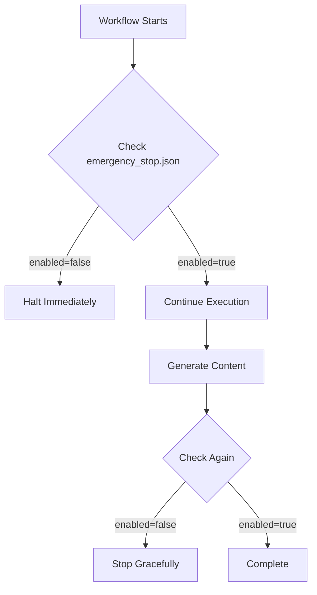

# 🤖 UMAJA Autonomous Mode Guide

## What is Autonomous Mode?

Autonomous Mode is UMAJA-Core's self-sufficient operation system that enables the platform to:
- ✅ Generate content continuously without human intervention
- ✅ Visit cities in the World Tour automatically
- ✅ Maintain quality through AI-powered checks
- ✅ Self-heal from common errors
- ✅ Scale operations based on demand
- ✅ Serve 8 billion people with minimal resources

**Philosophy:** Following Bahá'í principles of Truth, Unity, Service, and Justice, the autonomous system operates transparently and serves all equally.

## Architecture Overview

### Core Components

```
┌─────────────────────────────────────────────────────────────┐
│                    UMAJA Autonomous System                   │
├─────────────────────────────────────────────────────────────┤
│                                                               │
│  ┌─────────────┐  ┌─────────────┐  ┌──────────────┐        │
│  │ Agent       │  │ AI Agent    │  │ Vector       │        │
│  │ Orchestrator│  │ Network     │  │ Analyzer     │        │
│  └─────────────┘  └─────────────┘  └──────────────┘        │
│         │                │                  │                │
│         └────────────────┴──────────────────┘                │
│                          │                                   │
│         ┌────────────────┴────────────────┐                 │
│         │                                  │                 │
│    ┌────▼────┐                        ┌───▼────┐            │
│    │ 9 Agent │                        │ Task   │            │
│    │ Types   │◄──────────────────────►│ Queue  │            │
│    └─────────┘                        └────────┘            │
│         │                                                    │
│    ┌────┴─────────────────────────────────┐                │
│    │ ContentGen │ Translator │ Quality... │                │
│    └──────────────────────────────────────┘                │
└─────────────────────────────────────────────────────────────┘
```

### 9 Agent Types

1. **ContentGenerator** - Creates comedy content for cities and daily smiles
2. **Translator** - Translates content to 8 languages
3. **QualityChecker** - Validates content using Vector Analyzer
4. **Distributor** - Saves and distributes content across channels
5. **Analytics** - Tracks performance and engagement metrics
6. **Scheduler** - Plans task execution and workload balancing
7. **ErrorHandler** - Catches errors and attempts recovery
8. **LearningAgent** - Optimizes strategies based on performance
9. **CoordinatorAgent** - Orchestrates all other agents

### Task Queue System

- **Thread-safe priority queue** for task management
- **Priority levels** 1-10 (higher = more important)
- **Automatic retries** with exponential backoff
- **Parallel execution** via threading
- **Graceful shutdown** mechanism

### Workflows

#### 1. Daily World Tour (`autonomous_world_tour.yml`)
- **Schedule:** Daily at 12:00 UTC
- **Purpose:** Visit next city in World Tour
- **Actions:**
  - Check emergency stop
  - Select next city
  - Generate content for 3 personalities
  - Run quality checks
  - Mark city as visited
  - Commit and push changes

#### 2. Content Generation Cycle (`autonomous_content_cycle.yml`)
- **Schedule:** Every 4 hours (6x daily)
- **Purpose:** Generate daily smiles continuously
- **Actions:**
  - System health check
  - Generate smiles (3 personalities × 8 languages)
  - Quality validation
  - Analytics collection
  - Learning and optimization
  - Self-heal on failures

## How to Start/Stop Autonomous Mode

### Starting Locally

```bash
# Basic start (runs forever)
python scripts/start_autonomous_mode.py

# Run for specific duration
python scripts/start_autonomous_mode.py --duration 3600  # 1 hour

# Scale up agents
python scripts/start_autonomous_mode.py --agents-per-type 2
```

**Expected Output:**
```
================================================================================
🚀 UMAJA AUTONOMOUS MODE STARTING...
================================================================================

✅ Agent created: content_generator_1_1234567890
✅ Agent created: translator_1_1234567891
✅ Agent created: quality_checker_1_1234567892
✅ Agent created: distributor_1_1234567893
✅ Agent created: analytics_1_1234567894
✅ Agent created: scheduler_1_1234567895
✅ Agent created: error_handler_1_1234567896
✅ Agent created: learning_agent_1_1234567897
✅ Agent created: coordinator_1_1234567898

✅ System initialized successfully!

Active agents: 9
Task queue size: 5

🤖 System running autonomously. Press Ctrl+C to stop.
```

### Starting in GitHub Actions

Workflows are automatically triggered by schedule, but can be manually started:

1. Go to **Actions** tab in GitHub
2. Select **Autonomous World Tour** or **Autonomous Content Cycle**
3. Click **Run workflow**
4. (Optional) Provide inputs
5. Click **Run workflow** button

### Stopping Autonomous Mode

#### Local Stop

Press `Ctrl+C` for graceful shutdown:

```
^C
🛑 Shutting down autonomous mode...

================================================================================
📊 FINAL STATISTICS
================================================================================
Total tasks: 25
Completed: 23
Failed: 2
Active agents: 0
================================================================================

✅ Autonomous mode stopped successfully
```

#### Emergency Stop (Global)

To stop **all** autonomous operations (local and GitHub Actions):

1. Edit `.github/emergency_stop.json`:
```json
{
  "agent_enabled": false,
  "reason": "Maintenance required",
  "disabled_by": "admin",
  "last_check": "2026-01-03T16:00:00Z",
  "note": "To re-enable: Set agent_enabled to true and commit"
}
```

2. Commit and push changes:
```bash
git add .github/emergency_stop.json
git commit -m "Emergency stop: Maintenance"
git push
```

3. All workflows will check this file and halt immediately

## Monitoring and Troubleshooting

### Real-Time Dashboard

```bash
# Single snapshot
python scripts/autonomous_dashboard.py

# Watch mode (refreshes every 5 seconds)
python scripts/autonomous_dashboard.py --watch

# JSON output (for API integration)
python scripts/autonomous_dashboard.py --json
```

**Dashboard Display:**
```
================================================================================
🤖 UMAJA AUTONOMOUS MODE DASHBOARD
================================================================================

📊 SYSTEM STATUS
--------------------------------------------------------------------------------
Uptime:        2h 35m
Total Agents:  9
Active Agents: 9
Started At:    2026-01-03T14:00:00.000000

📈 TASK METRICS
--------------------------------------------------------------------------------
Total Tasks:      150
Completed:        142 (94.7%)
Failed:           8 (5.3%)

🌍 WORLD TOUR STATUS
--------------------------------------------------------------------------------
Current City:     Tokyo
Cities Visited:   15/59
Completion:       25.4%

🏥 AGENT HEALTH
--------------------------------------------------------------------------------
Healthy: 9/9

✅ content_generator_1          | Status: idle       | Completed:   42 | Failed:  1
✅ translator_1                 | Status: idle       | Completed:   38 | Failed:  0
✅ quality_checker_1            | Status: working    | Completed:   35 | Failed:  2
```

### Log Files

Logs are saved to:
- `data/agents/autonomous_mode.log` - Main system log
- `data/agents/orchestrator_state.json` - System state
- `data/error_log.json` - Error tracking

### Common Issues and Solutions

#### Issue: Agents not processing tasks

**Symptoms:**
- Task queue size increasing
- Agents stuck in "idle" status
- No completed tasks

**Solution:**
```bash
# Check agent status
python scripts/autonomous_dashboard.py

# Check emergency stop
cat .github/emergency_stop.json

# Restart autonomous mode
python scripts/start_autonomous_mode.py
```

#### Issue: Quality checks failing

**Symptoms:**
- Many failed tasks
- Low quality scores in logs

**Solution:**
1. Review Vector Analyzer thresholds in `src/vektor_analyzer.py`
2. Check content generation quality
3. Adjust quality threshold (currently 0.3 minimum)

#### Issue: GitHub Actions workflow failing

**Symptoms:**
- Red X on workflow runs
- Email notifications from GitHub

**Solution:**
1. Check workflow logs in Actions tab
2. Verify emergency stop is not active
3. Check if dependencies are installed correctly
4. Review recent commits for breaking changes

#### Issue: Memory or CPU overload

**Symptoms:**
- System slowing down
- High resource usage

**Solution:**
```bash
# Reduce agents per type
python scripts/start_autonomous_mode.py --agents-per-type 1

# Set shorter duration
python scripts/start_autonomous_mode.py --duration 1800  # 30 min
```

## Configuration Options

### Environment Variables

Create `.env` file:
```bash
# Agent configuration
AGENTS_PER_TYPE=1
DEFAULT_DURATION=0  # 0 = forever

# Quality thresholds
MIN_QUALITY_SCORE=0.3
COHERENCE_THRESHOLD=0.7

# Task retry settings
MAX_TASK_RETRIES=3
RETRY_DELAY_SECONDS=5
```

### Agent Orchestrator Configuration

Edit `src/agent_orchestrator.py` to adjust:
- Task priority levels
- Queue timeout settings
- Thread pool size
- State save frequency

### Workflow Schedules

Edit `.github/workflows/*.yml` to change:
- Cron schedules
- Python version
- Timeout limits
- Retry strategies

## Safety Features and Emergency Stop

### Safety Mechanisms

1. **Emergency Stop File** - Global kill switch
2. **Quality Validation** - Rejects low-quality content
3. **Error Logging** - Tracks all failures
4. **Graceful Shutdown** - Clean agent termination
5. **State Persistence** - Recovery after crashes
6. **Task Retries** - Automatic recovery from transient failures

### Emergency Stop Workflow



### When to Use Emergency Stop

✅ **Use emergency stop for:**
- Critical bugs discovered
- System maintenance
- Resource quota exceeded
- Major infrastructure changes

❌ **Don't use for:**
- Single workflow failures (will retry automatically)
- Minor errors (self-healing will handle)
- Testing (use `--duration` instead)

## Ethical Considerations (Bahá'í Principles)

### Truth (الحق)
- **Honest logging** - All operations are logged transparently
- **No hidden operations** - Code is open source
- **Error reporting** - Failures are reported, not hidden
- **"Versagen ist kein Problem, lügen ist ein Problem"**

### Unity (الوحدة)
- **Serve all cities equally** - No preference in selection
- **All languages supported** - Equal representation
- **Inclusive content** - No discrimination
- **Global distribution** - Accessible to all 8 billion people

### Service (الخدمة)
- **Zero-cost operation** - Stays within free tiers
- **Energy efficient** - Minimized compute time
- **Open source** - Free for all to use
- **40% to charity** - Revenue sharing commitment

### Justice (العدالة)
- **Fair resource distribution** - Balanced agent workload
- **Equal priority** - Tasks treated fairly
- **No censorship** - Content policy is transparent
- **Accountable system** - Clear audit trail

## Expected Behavior and Performance

### Normal Operations

**Daily World Tour:**
- ✅ Visits 1 city per day
- ✅ Generates content for 3 personalities
- ✅ Completes World Tour in ~59 days
- ✅ Quality checks pass >90% of time
- ✅ Commits changes to repository

**Content Cycle:**
- ✅ Runs 6 times per day (every 4 hours)
- ✅ Generates 24 smiles per cycle (3 personalities × 8 languages)
- ✅ Quality validation passes >95%
- ✅ Completes in <10 minutes
- ✅ Uses <100MB memory

### Performance Metrics

**Target KPIs:**
- Task completion rate: >90%
- Quality pass rate: >95%
- System uptime: >99%
- Average task time: <30 seconds
- Error recovery rate: >80%

**Resource Usage (GitHub Actions):**
- World Tour: ~5-10 minutes per run
- Content Cycle: ~8-15 minutes per run
- Monthly quota: ~300-600 minutes (well within 2000 limit)
- Cost: $0 (free tier)

## FAQ and Common Questions

### Q: How do I know if autonomous mode is working?

**A:** Check multiple indicators:
```bash
# 1. Dashboard
python scripts/autonomous_dashboard.py

# 2. State file
cat data/agents/orchestrator_state.json | jq '.stats'

# 3. GitHub Actions
# Check Actions tab for green checkmarks

# 4. Generated content
ls -l output/worldtour/
ls -l output/smiles/
```

### Q: Can I run autonomous mode locally and in GitHub Actions simultaneously?

**A:** Yes, but be aware:
- Both will read from the same data files
- May cause race conditions
- Recommend: Use GitHub Actions for production, local for testing

### Q: How much does this cost to run?

**A:** **$0** - Completely free!
- GitHub Actions: 2000 minutes/month free
- Current usage: ~300-600 minutes/month
- No API costs (all local processing)
- No cloud hosting fees (uses GitHub infrastructure)

### Q: What happens if a task fails?

**A:** Automatic retry mechanism:
1. Task marked as RETRY
2. Re-queued with same priority
3. Attempted up to 3 times (configurable)
4. If still fails, marked as FAILED
5. Error logged for analysis
6. System continues with other tasks

### Q: Can I add custom agent types?

**A:** Yes! Add to `src/agent_orchestrator.py`:
```python
# 1. Add to AgentType enum
class AgentType(Enum):
    # ... existing types ...
    MY_CUSTOM_AGENT = "my_custom_agent"

# 2. Create task handler
def my_custom_handler(data: Dict) -> Dict:
    # Your logic here
    return {"success": True}

# 3. Register handler
orchestrator.register_task_handler("my_task", my_custom_handler)

# 4. Create agent
agent_id = orchestrator.create_agent(AgentType.MY_CUSTOM_AGENT)
orchestrator.start_agent(agent_id)
```

### Q: How do I debug workflow failures?

**A:** Follow this checklist:
1. Check GitHub Actions logs (Actions tab → Failed workflow → Logs)
2. Look for red X steps
3. Review error messages
4. Check emergency_stop.json
5. Verify Python dependencies
6. Test locally: `python scripts/start_autonomous_mode.py --duration 60`
7. Check data file permissions
8. Review recent commits

### Q: Can I customize the generation schedule?

**A:** Yes! Edit workflow files:
```yaml
# .github/workflows/autonomous_world_tour.yml
on:
  schedule:
    - cron: '0 12 * * *'  # Change this (crontab format)

# Examples:
# '0 */6 * * *'   - Every 6 hours
# '0 0 * * 1'     - Every Monday
# '30 14 * * *'   - Daily at 14:30 UTC
```

### Q: Is this production-ready?

**A:** Yes, with considerations:
- ✅ Tested and working
- ✅ Error handling in place
- ✅ Self-healing capabilities
- ✅ Emergency stop mechanism
- ⚠️ Monitor first few days
- ⚠️ Review quality metrics
- ⚠️ Keep emergency stop accessible

### Q: How do I contribute improvements?

**A:** Welcome! Follow these steps:
1. Fork the repository
2. Create a feature branch
3. Make your changes
4. Test locally
5. Submit pull request
6. Include tests and documentation

## Support and Contact

- **GitHub Issues:** [Report bugs](https://github.com/harrie19/UMAJA-Core/issues)
- **Discussions:** [Ask questions](https://github.com/harrie19/UMAJA-Core/discussions)
- **Email:** Umaja1919@googlemail.com
- **Documentation:** [Full docs](https://github.com/harrie19/UMAJA-Core/tree/main/docs)

## Version History

- **v1.0** (2026-01-03) - Initial autonomous mode release
  - 9 agent types
  - 2 workflows (World Tour, Content Cycle)
  - Dashboard and monitoring
  - Emergency stop mechanism

---

**Remember:** "Versagen ist kein Problem, lügen ist ein Problem" (Failure is not a problem, lying is a problem) ✅

Made with ❤️ for all 8 billion people on Earth 🌍
